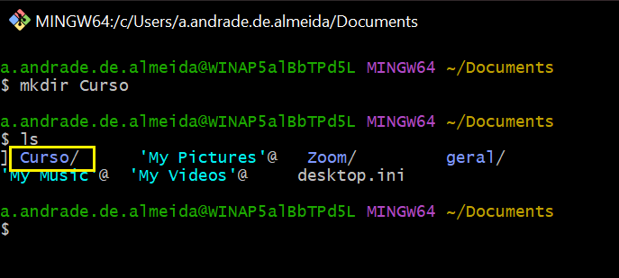
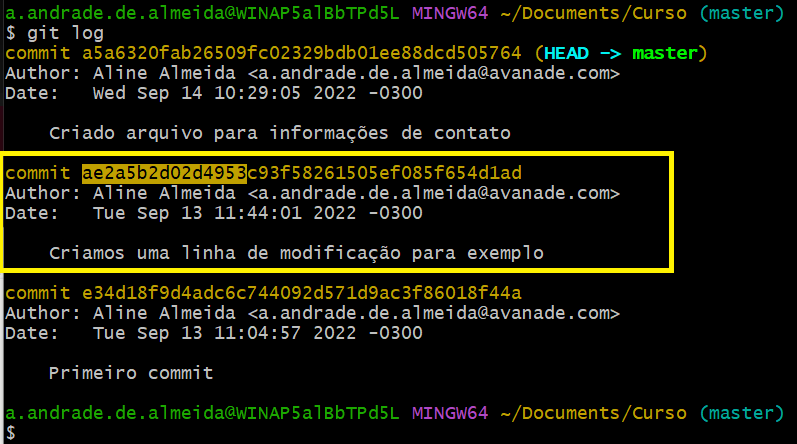
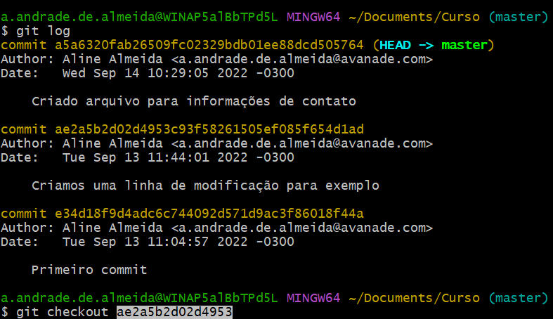
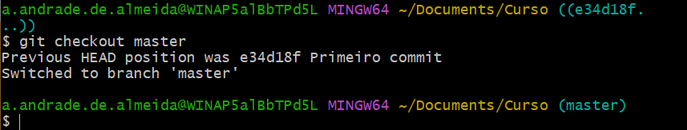

# GIT e GitHub

## 1 - SISTEMA DE CONTROLE DE VERSÃO
#### Ele vai permitir controlar alterações que ocorreram no decorrer de um tempo em um arquivo ou no projeto inteiro e isso vai facilitar quando precisarmos voltar trechos, ou saber quem fez aquela alteração, quando, porque e como fez, vai nos permitir também trabalhar em um grupo de desenvolvedores. Muitas vezes podemos ter na equipe até umas 10 pessoas trabalhando no mesmo projeto e, consequentemente no mesmo arquivo. E o sistema de controle de versão vai ter a inteligencia de saber juntar as alterações de cada desenvolvedor daquele arquivo. E quando todo mundo está colocando a mão no mesmo arquivo a chance de acontecer uma bobagem é gigantesca.

<br/>


## 2 - INSTALAÇÃO E CONFIGURAÇÃO DO GIT
#### Agora que ja sabemos o que é o controlador de versões e pra que serve, vamos então utilizá-lo.

#### Iniciando pela configuração do GIT:
```git
    git config --global user.name "seu nome"
    git config --global user.email "seu email"
```
#### Este comando acima configura o usuario que vai utilizar o Git, e no caso utilizamos o comando global para que seja configurado apenas uma vez, sem ter a necessidade de configurar a cada novo projeto.
#### Para verificar a configuração feita acima use o comando:
```git
    git config user.name
```
#### E aparecerá o nome que está configurado, assim:

<p align="center">
  
</p>

#### Para ver o email é:
```git
    git config user.email
```
#### E...
<p align="center">
  
</p>

<br/>
    
## 3 - ESTADOS DOS ARQUIVOS E COMMITS    
#### Para iniciar um projeto usamos o comando:
```git
    git init
```

#### Voce pode criar um arquivo manualmente ou usando o comando:
```git
    touch nome do arquivo.formato
```
#### E se for uma pasta, podemos criar usando o comando:
```git
    mkdir nome da pasta
```
#### Assim:
<p align="center">
  
</p>

#### Usei om comando:
```git
    ls 
```
#### Para listar os itens da pasta em que estou e la está, a pasta **Curso** que criei.

#### Agora vamos começar a versionar os arquivos. Vamos criar um arquivo txt dentro do nosso repositório.
```git
    touch index.txt
```
#### E:
<p align="center">
  
</p>

#### O arquivo foi criado porém ainda não foi versionado. Vamos usar o comando:
```git
    git status
```

#### Para ver como está o arquivo criado:
<p align="center">
  
</p>

#### Esta dizendo que temos um arquivo do tipo **untracked** na master. O que significa que esse arquivo ainda não é conhecido no nosso repositório, é um arquivo novo e ainda não foi versionado. \ou seja, o comando **git status** sempre vai retornar o status em que se encontra o arquivo ou o projeto.
#### Para apontar para o git o aquivo ou o projeto a ser versionado, usamos o comando:
```git
    git add nome do arquivo.extensão
```
#### Para versionar o arquivo, Ou
```git
    git add .
```
#### Para versionar todo o conteúdo ou projeto, vamos ver:
<p align="center">
  
</p>

#### **DICA: Para versionar vários arquivos ao mesmo tempo, basta adicionar um a um com a estensão seguido de espaço.**

#### Após ter adicionado, perceba que o git não nos retornou nada, ou seja, ele ja adicionou. Se usarmos o comando:
```git
    git status
```

#### Vamos notar:
<p align="center">
  
</p>

#### Então agora o Git está reconhecendo o novo arquivo e poderá versioná-lo. Quando usamos o comando **git add** estamos informando ao Git que existe um arquivo que deve ser monitorado pois está aguardando numa área temporária para ser versionado. Agora vamos usar o comando:
```git
    git commit -m "mensagem"
```
#### Na mensagem procure ser o mais simples e direto possível especificando sempre o que foi feito naquele versionamento para que fique documentado de uma forma correta e clara.
#### E
<p align="center">
  
</p>

#### Assim, então, nosso arquivo foi versionado.

## 4 - NAVEGAÇÃO ENTRE AS VERSÕES
    
#### Agora que ja sabemos criar as versões através dos comandos: 
```git
    git add
    git status
    git commit
```
#### Vamos fazer uma simulação da evolução do código fonte e como podemos voltar e avançar entre as versões. Vamos então criar mais umas duas versões e navegar entre elas. No nosso projeto criamos um arquivo chamado **index.txt** que está vazio, ou seja, a versão 1 é a versão em branco do arquivo criado. Pra ver o histórico que ja possuimos, quais foram as alterações que ja aconteceram, ou o que ja foi criado, usamos o comando:
```git
    git log
```
#### Podemos navegar por esse histórico, mesmo se for grande:
<p align="center">
  
</p>

#### Mas, no nosso exemplo tem somente uma. Analisando a foto acima, notamos que:
- existe o ID do commit e onde foi feito
- o autor do commit (nome e email)
- a data do commit
- e a mensagem que foi passada no commit

#### Vamos fazer algumas alterações nesse arquivo. Abra ele e digite algo e salve depois:

<p align="center">
  
</p>

#### Agora no terminal digirte o comando:
```git
    git status
```
#### Perceba que o status do arquivo foi alterado:

<p align="center">
  
</p>

#### E para ver a alteração que foi feita usamos o comando:
```git
    git diff
```
#### E
<p align="center">
  
</p>

#### Analisando a foto acima, o comando usado retorna:
- o nome do arquivo que foi alterado
- o ID da alteração
- que foi adicionada +1 linha no arquivo
- no caso, a mensagem que foi adicionada ao arquivo
#### Então, concluimos até aqui que, realmente foi feita essa alteração incluindo a mensagem no arquivo, e tendo a ceteza então que está tudo correto, vamos adicionar esse arquivo para ser versionado usando o comando:
```git
    git add .
```
#### E vamos usar agora o:
```git
    git status
```
#### Para verificar o status da alteração:
<p align="center">
  
</p>

#### Ele retorna com o status modified, ou seja, o arquivo ja está separado para ser versionado através do commit:
```git
    git commit -m "Criamos uma linha de modificação para exemplo"
```
#### Assim ele mostra:
<p align="center">
  
</p>

#### Que foi feita uma alteração no arquivo com apenas uma inserção. Então se digitarmos o comando:
```git
    git log
```
#### Vamos notar que:
<p align="center">
  
</p>

**Ctrl L**: limpa a tela

#### Agora temos dois commits mostrados em ordem decrescente, pode ocorrer de aparecem os dois pontos na tela do git **":"**, o que significa que o git está em modo de navegação para que possa navegar entre os logs usando as teclas seta para cima ou para baixo, para sair do modo de navegação use a tecla Q.
#### E vamos usar agora o:
```git
    git status
```
#### Veremos que não te mais nada para commitar. Agora vamos criar mais uma versão. Crie um novo arquivo.
<p align="center">
  
</p>

#### No caso criei um documento com o nome de contato.txt. Agora vamos usar o comando:
```git
    git status
```
#### Para verificar e... :
<p align="center">
  
</p>

#### O Git ja reconheceu o novo arquivo. Agora vamos adicioná-lo:
```git
    git add contato.txt
```
#### Agora vamos ver o status:
```git
    git status
```
#### E...
<p align="center">
  
</p>

#### O Git ja está observando o arquivo novo, pois adicionamos ele á fila tremporária do Git. Agora vamos commitar o arquivo.
```git
    git commit -m "Criado arquivo para informações de contato"
```
#### E vamos observar...
<p align="center">
  
</p>

#### O arquivo novo foi commitado. Agora vamos usar o comando:
```git
    git log
```
#### E...
<p align="center">
  
</p>

#### Temos agora 3 commits, como foi realmente feito. Mas além de verificar os commits, podemos navegar por eles, ou entre eles. E para navegar entre os commits usamos o comando:
```git
    git checkout
```
#### Este comando navega entre commits, entre branches, entre versões... etc. Vamos pegar a hash de onde queremos ir. **A hash é o ID.** Não é necessário pegar a hash toda, podemos pegar somente uma parte dela, geralmente os 10 primeiros, vamos ver na prática com o segundo commit:
<p align="center">
  
</p>

#### Copiamos ele e 
<p align="center">
  
</p>

#### Colamos depois do comando **git checkout** e 
<p align="center">
  
</p>

#### Agora se eu digitar **git log**, eu só possuo os dois commits
<p align="center">
  
</p>

#### e porque? Por que os 3 commits estão na master e perceba na figura que não estamos mais na master... estamos na hash do commit e se voce olhar na pasta, voce notará que só existe apenas o arquivo anterior:
<p align="center">
  
</p>

#### porque dentro do commit que estamos só há este arquivo, o outro foi criado em outro commit e estamos numa versão antes. Se pegarmos o primeiro commit que criamos: 
<p align="center">
  
</p>

#### Vamos olhar agora a pasta:
<p align="center">
  
</p>

#### perceba que voltamos então ao arquivo vazio, antes de termos digitado algo dentro dele, agora se voltarmos para a master:
<p align="center">
  
</p>

#### Na pasta...
<p align="center">
  
</p>

#### Voltou a exibir os 3 arquivos, porque os arquivos estão na master.


## 5 - DESFAZENDO AS ALTERAÇÕES

#### Vamos supor que... voce tenha criadon um arquivo dentro do projeto errado, podemos deletá-lo usando o comando:
```git
  git clean -f
```
#### O parâmetro -f, é para forçar a limpeza dos arquivos que não foram versionados ainda. Mas esse comando só pode ser usado para arquivos que ainda não foram versionados.
#### Para restaurar o arquivo para a ultima versão usamos o comando:
```git
  git reset --hard HEAD~0
```
#### Esse **~0** significa que estamos voltando para a versão anterior, mas podemos voltar para outras versões, é só alterar o 0 e trocar por outro número conforme a versão que queremos voltar, ou seja, o 0 volta pra última, o 1 voltará pra penúltimas e assim por diante. 

## 6 - TRABALHANDO COM BRANCHES E TAGS
#### Existe uma forma para não utilizarmos as hashs que são gigantes, para tornar os checkouts mais intuitivos e simples, podemos trabalhar com tags. Elas vão nos permitir nomear as hashes gigantes, então ao inves de fazer checkout com as hashes de 40 caracteres, podemos fazer um checkout para um nome mais sucinto, exemplo: v1, v2, v3.... Vamos ver na prática:

### Val=mos navegar pelo histórico usando o comando:
```git
  git log
```
#### Observando as hashes gigantes, vamos dar nome a elas, consequentemente vamos nomear a ultima... porque é nela que estamos:
```git
  git tag v2
```
#### Se dermos o comando:
```git
  git log
```
#### Notaremos que o nome ja foi acrescentado.

## 7 - MERGE

#### É quando podemos mesclar branches diferentes.
    
## 8 - RESOLUÇÃO DE CONFLITOS

#### Conflitos acontecem quando há mais de um programador trabalhando no mesmo código. Quando mais de uma pessoa trabalha no mesmo arquivo, há mais de uma alteração, com isso irá gerar um conflito, pois o git vai querer saber quais mudanças seráo aceitas. E ai dicidinmos se vamos manter todas as alterações ou quais delas que vamos manter. Usando o comando git status vamos perceber se há arquivos conflitados.

## 9 - IGNORANDO ARQUIVOS DO REPOSITÓRIO

#### Para ignorarmos um arquivo, usamos o comando ***touch .gitignore***, ele criará um arquivo com esse nome **.gitignore** e o que for incluso nela será ignorado. Num projeto há muitos arquivos que são por padrão ignorados, e pra isso existe um gerador online [gitignore.io](gitignore.io) que, gera o **.gitignore** de acordo com a linguagem ou IDE que estamos utilizando, é bom pois caso venhamos a esquecer algo, nesse site temos a ceteza que estarão inclusos. Uma boa prática é iniciar o projeto e ja criar o arquivo **.gitignore** para não correr riscos de esquecer algo conforme for sendo construido o projeto.
    
## 10 - TRABALHANDO COM REPOSITÓRIOS REMOTOS

#### No GitHub, clicamos em **New Repository**, na sequencia damos um nome a ele, uma descrição, escolha se será público ou privado, e então se queremos o arquivo README no nosso projeto, podemos incluí-lo agora. Se voce está criando o projeto aqui no GitHub e ele não existe localmente, siga esses comandos:
<p align="center">
  
</p>

#### Caso ja tenha um repositório, siga esses comandos:
<p align="center">
  
</p>


